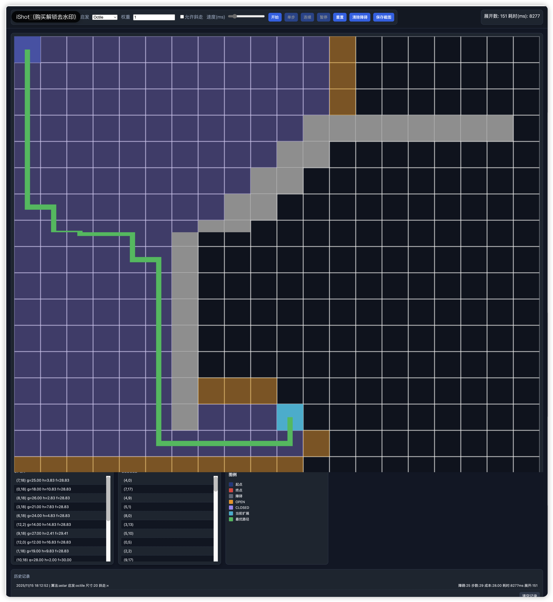

# 二维循迹搜索可视化平台（Web + Python/uv）

## 功能概览
- 在浏览器中演示二维网格上的搜索过程，支持设置起点/终点与障碍物。
- 支持单步与连续执行，动态展示 OPEN/CLOSED 的变化、当前扩展节点、所有扩展路径与最优路径。
- 提供 A*、Dijkstra、贪心等搜索方法；A* 可选择不同启发函数（Manhattan/Euclidean/Octile/Chebyshev/Zero）与权重。
- 支持 4/8 邻域与斜走开关，显示展开节点数与耗时等指标。
- 支持 LLM-A*：结合 DeepSeek 等 LLM 生成中间目标点（waypoints）引导搜索，降低扩展规模。

### A* 搜索示例


## 环境与运行（uv）
- 进入项目根目录：`cd astar-web`
- 初始化并运行后端（uv 自动创建并管理虚拟环境）：
  - 开发服务器：`uv run uvicorn backend.app:app --reload --port 8000`
  - 浏览器打开：`http://127.0.0.1:8000/`
  
### LLM-A* 配置
- 在 `backend/algorithms/.env` 填写密钥与模型信息（可参考 `backend/algorithms/.env.example`）：
  - `LLM_API_KEY="<你的密钥>"`
  - `LLM_MODEL_ID="deepseek-chat"`
  - `LLM_BASE_URL="https://api.deepseek.com"`
- `.env` 已被 `.gitignore` 忽略，避免泄露密钥。
- 若未配置或请求失败，会自动回退为普通 A* 的行为（保证可用）。

## 使用说明
- 交互：
  - 点击画布可添加/移除障碍；`Shift+点击` 设置起点；`Alt+点击` 设置终点。
  - 面板选择算法、启发函数、权重、是否允许斜走，设置尺寸后点击“开始”。
  - 使用“单步”推进一次；“连续”自动推进；“暂停”停止；“重置”清空并恢复。
- 可视化：
  - 蓝色起点、红色终点、灰色障碍、黄色 OPEN、紫色 CLOSED、青色当前扩展、绿色最优路径。
  - OPEN/CLOSED 表显示坐标与 g/h/f（OPEN）。

### 选择 LLM-A*
- 在“算法”下拉框选择 `LLM-A*`（前端已内置选项）。
- 已配置 `.env` 时后端将调用 DeepSeek 生成 waypoints 并引导搜索；否则自动回退普通 A*。
- 也可通过设置环境变量 `LLM_GUIDE=1` 并选择普通 `A*` 来启用后端的 LLM 引导模式。

## 算法与实现
- 后端：`FastAPI` + `WebSocket` 流式推送步骤快照；`numpy` 用于启发计算；`pydantic` 定义协议模型。
- 搜索步进：每次展开一个节点并返回 `snapshot`（当前节点、邻居、OPEN/CLOSED、路径、统计）。
- 启发函数：
  - Manhattan：`|dx| + |dy|`（4邻域建议）。
  - Euclidean：`sqrt(dx^2 + dy^2)`。
  - Octile（对角/8邻域）：`dx + dy + (sqrt(2)-2)*min(dx,dy)`（参考开源实现）。
  - Chebyshev：`max(|dx|,|dy|)`；Zero 等价 Dijkstra。

## 目录结构
- `backend/`：`app.py`（服务端与静态文件）、`algorithms/`（`grid.py`、`base.py`、`astar.py`、`dijkstra.py`、`greedy.py`、`llm_astar.py`）、`models.py`
- `frontend/`：`index.html`、`app.js`、`styles.css`
- `tests/`：`test_astar.py`、`test_llm_astar.py`
- `backend/algorithms/.env.example`：LLM 配置模板（真实 `.env` 已忽略）

## 对比实验建议
- 使用相同地图与起终点，分别运行不同启发函数与算法；观察展开规模、耗时、路径长度与总成本。
- A* 权重调整（`f=g+w*h`）可让搜索更接近贪心（大权重）或 Dijkstra（权重趋近 0）。

## 参考与致谢
- 参考开源项目：`/a-star-algorithm`，复用 Octile 启发与 8邻域扩展思路（`a_star.py:23,29,124-137`）。

## 后续可扩展
- 增加 BFS/IDA*、障碍批量生成与迷宫生成、路径平滑与可视化叠加对比、导入导出实验报告。

## 目录结构（树状）
```
astar-web/
├── backend/
│   ├── app.py                 FastAPI 应用，HTTP 首页与 /ws WebSocket 通道、静态文件服务
│   └── algorithms/
│       ├── grid.py            网格模型：尺寸、障碍、邻居生成（4/8 邻域）、移动代价
│       ├── base.py            搜索基类：OPEN/CLOSED、父指针 parent_map、步进快照
│       ├── astar.py           A* 算法：支持启发函数与权重、返回最优路径与统计
│       ├── dijkstra.py        Dijkstra（A* 的零启发/零权重特化）
│       └── greedy.py          贪心最佳优先（仅按启发排序，非最优）
├── frontend/
│   ├── index.html             页面结构：工具栏、画布、表格、图例与历史记录
│   ├── styles.css             统一深色主题与卡片风格、响应式布局、斑马纹表格
│   └── app.js                 交互与绘制：WebSocket 通信、Canvas 渲染、拖拽障碍、历史记录与截图
├── tests/
│   └── test_astar.py          算法单元测试：A* 零启发与 Dijkstra 等价性
└── pyproject.toml             uv 项目配置与依赖（fastapi、uvicorn、pydantic、numpy、pytest、websockets）
```

## 模块与功能映射
- `backend/app.py`：静态页面服务、WebSocket `/ws` 收发协议（start/step/reset），在 `start` 返回初始快照。
- `backend/algorithms/grid.py`：网格模型、邻居生成与移动代价；支持 4/8 邻域与斜走开关。
- `backend/algorithms/base.py`：通用搜索基类，维护 OPEN/CLOSED 与 `parent_map`，生成步进快照。
- `backend/algorithms/astar.py`：A* 搜索，支持启发函数与权重，结束时用 `parent_map` 重建路径并返回统计。
- `backend/algorithms/dijkstra.py`：A* 的零启发/零权重特化，实现 Dijkstra。
- `backend/algorithms/greedy.py`：贪心最佳优先，按启发排序，适合对比展示。
- `backend/algorithms/llm_astar.py`：LLM 引导的 A*，调用 DeepSeek 生成 waypoints，并在启发中同时考虑当前目标点与终点。
- `frontend/index.html`：页面骨架与控件（开始/单步/连续/暂停/重置/清除障碍/保存截图/历史记录）。
- `frontend/app.js`：WebSocket 通信；Canvas 渲染（半透明 OPEN/CLOSED、粗线路径）；坐标映射与拖拽障碍；历史记录与截图导出。
- `frontend/styles.css`：深色主题、卡片与表格风格、响应式布局与网格；历史记录卡片全宽展示。

## 使用补充
- 障碍操作：单击或拖拽添加/擦除；重置保留障碍，“清除障碍”仅清空障碍集合。
- 截图导出：点击“保存截图”将当前网格渲染导出为 PNG 文件。
- 历史记录：每次搜索完成自动记录时间、算法、启发、尺寸、斜走、障碍数、步数、成本、耗时与展开数，可“清空记录”。

## 安全与隐私
- `.env` 文件包含密钥与服务地址，已通过 `.gitignore` 忽略，请勿提交到仓库。
- 如需共享配置，请使用 `backend/algorithms/.env.example` 模板并在本地填写真实密钥。
